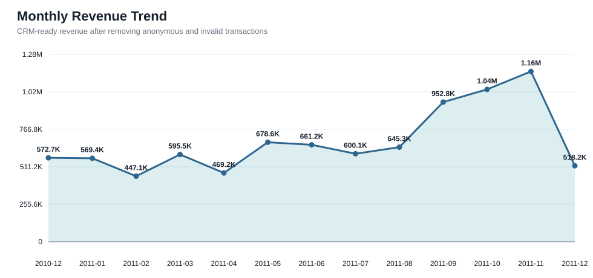
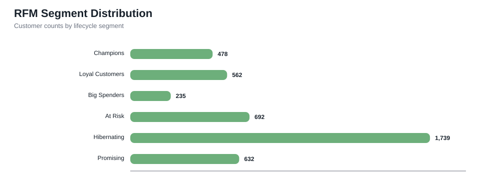
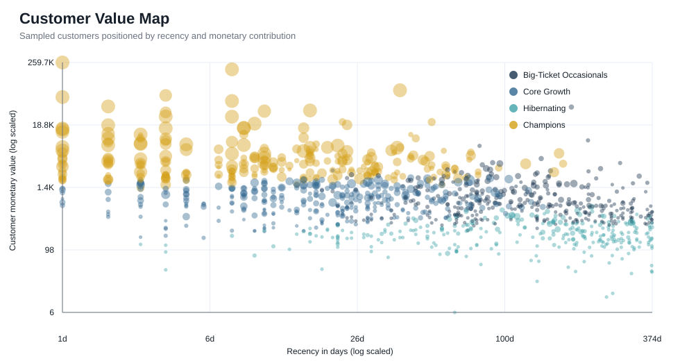

# Online Retail CRM Analysis and Customer Segmentation

A beginner-friendly data analysis project that turns online retail transactions into useful customer
segments. The project uses exploratory data analysis, RFM scoring, and K-means clustering to identify
valuable customers and suggest practical marketing actions.

The main notebook is already executed, so its tables and charts are visible directly on GitHub.

## Project Highlights

- Cleaned raw transaction data for missing customer IDs, returns, and invalid pricing
- Performed EDA on revenue trends, country performance, and product contribution
- Built customer-level RFM features for CRM campaign planning
- Implemented K-means clustering with scikit-learn
- Generated an executive-style HTML report with visuals and exportable CSV outputs
- Included an executed Jupyter notebook with saved tables and charts for direct GitHub viewing

## Project Workflow

```text
Raw Transactions
      |
      v
Data Quality Checks
      |
      v
Data Cleaning
      |
      v
Exploratory Data Analysis
      |
      v
RFM Customer Segmentation
      |
      v
K-means Clustering
      |
      v
CRM Recommendations and Export
```

## Business Problem

Retail businesses often have transaction data but lack a structured customer view.  
This project converts raw orders into CRM-ready insights so a business can:

- identify high-value customers
- spot inactive or at-risk buyers
- understand revenue concentration
- design retention, reactivation, and upsell campaigns

## Tech Stack

- Python
- pandas
- numpy
- matplotlib
- seaborn
- scikit-learn
- JupyterLab

## Key Results

| Result | Value |
|---|---:|
| Clean revenue | `$8.91M` |
| Customers analyzed | `4,338` |
| Countries represented | `37` |
| UK revenue share | `82.01%` |
| Highest-revenue month | `November 2011` |
| Revenue from Champions | `$6.82M` |

## Project Visuals

### Monthly Revenue



### RFM Segment Distribution



### Customer Value Map



## Repository Structure

```text
online_retail_crm_project/
|-- Online_Retail_CRM_Analysis.ipynb
|-- GITHUB_UPLOAD_GUIDE.md
|-- PORTFOLIO_GUIDE.md
|-- data/
|   |-- README.md
|-- output/
|   |-- README.md
|   |-- analysis_report.html
|   |-- executive_summary.md
|   |-- customer_segments_simple.csv
|   |-- customer_rfm_segments.csv
|   |-- cluster_profile.csv
|   |-- kmeans_diagnostics.csv
|   |-- monthly_revenue.csv
|   |-- rfm_segment_summary.csv
|   |-- top_products.csv
|   |-- figures/
|-- src/
|   |-- analyze_online_retail.py
|   |-- generate_notebook.py
|-- .gitignore
|-- README.md
|-- requirements.txt
```

## Dataset Setup

1. Download or copy `OnlineRetail.csv`
2. Place it inside the `data/` folder
3. Keep the filename as `OnlineRetail.csv`

The dataset itself is not committed so the repository stays lightweight and GitHub-ready.

## How to Run

Install dependencies:

```powershell
pip install -r requirements.txt
```

Open the notebook:

```powershell
jupyter lab Online_Retail_CRM_Analysis.ipynb
```

Run each cell from top to bottom. The notebook uses the simple relative path
`data/OnlineRetail.csv`.

To regenerate the executed notebook automatically:

```powershell
python src/generate_notebook.py
```

To generate the detailed HTML report and supporting tables:

```powershell
python src/analyze_online_retail.py
```

If your dataset is in another location, run:

```powershell
python src/analyze_online_retail.py --input "path\to\OnlineRetail.csv" --output-dir output
```

## Outputs

The script generates:

- `output/analysis_report.html` for a polished portfolio-ready report
- `output/executive_summary.md` for quick recruiter or resume talking points
- `output/customer_segments_simple.csv` from the beginner-friendly notebook
- `output/customer_rfm_segments.csv` with customer-level features and labels
- `output/cluster_profile.csv` with cluster summaries
- `output/kmeans_diagnostics.csv` with clustering diagnostics
- `output/figures/` with SVG charts

The repository also includes `Online_Retail_CRM_Analysis.ipynb`, a beginner-friendly executed notebook.
It uses direct pandas and scikit-learn code, short explanations, and saved charts so the full analysis
is visible directly on GitHub.

## Publish on GitHub

Use the lightweight `online_retail_crm_project_github_ready.zip` package and follow
`GITHUB_UPLOAD_GUIDE.md`. The raw CSV is excluded because GitHub web uploads have file-size limits and
the executed notebook already preserves the analysis outputs.

## Key Insights from This Run

- CRM-ready cleaned revenue: about `$8.91M`
- Identified customers used for CRM analysis: `4,338`
- Revenue concentration in the UK: `82.01%`
- Champions generate about `$6.82M` and are the most valuable RFM segment
- November 2011 is the highest-revenue month

## CRM Recommendations

| Segment | Recommended Action |
|---|---|
| Champions | VIP rewards, early access, and referral benefits |
| Loyal Customers | Loyalty rewards, bundles, and cross-selling |
| Potential Loyalists | Personalized offers encouraging another purchase |
| Needs Attention | Reminders and limited-time re-engagement discounts |
| At Risk | Win-back campaigns and customer feedback surveys |

## Resume-Ready Skills Demonstrated

- Exploratory Data Analysis
- Customer Segmentation
- RFM Analysis
- Unsupervised Machine Learning
- Business Intelligence Storytelling
- Reproducible Data Science Projects

## Limitations and Future Improvements

- Product cost and profit data are unavailable, so the analysis focuses on revenue rather than profit.
- Anonymous transactions cannot be used for customer-level segmentation.
- The project uses historical batch data rather than live customer activity.
- Future work could add a Streamlit dashboard, customer lifetime value, and recommendation models.

## Suggested GitHub Repository Name

- `online-retail-crm-analysis`
- `crm-customer-segmentation-project`
- `retail-customer-analytics`
